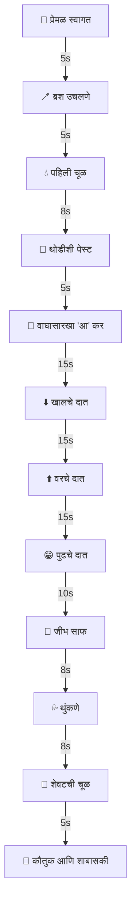
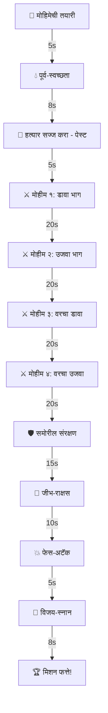

येथे 'ToothBuddy' (टूथ-बडी) साठी मराठीतील विशेष कस्टमाइज्ड स्क्रिप्ट आणि स्टोरीबोर्ड आहे. आपण भाषेतील गोडवा आणि महाराष्ट्राच्या सांस्कृतिक संदर्भांचा विचार करून यामध्ये बदल केले आहेत.

# टूथ-बडी (ToothBuddy) - मराठी स्टोरीबोर्ड आणि स्क्रिप्ट

## १. परी ताई (१ ते ४ वर्षे) - 'Pari Tai'

**आवाज**: प्रेमळ, आईसारखा किंवा मोठ्या बहिणीसारखा | **पिच (Pitch)**: १.४ | **वेग (Rate)**: ०.७५

**संगीत**: मऊ बासरी आणि संतूरचे सूर (अंगाई गीतासारखे शांत)

**एकूण वेळ**: ~२.५ मिनिटे

### प्रवाह चित्र (Flow Diagram)

### टप्प्याटप्प्याने स्क्रिप्ट

| # | टप्पा | वेळ | ॲनिमेशन | संवाद (मराठी) |
| --- | --- | --- | --- | --- |
| १ | **स्वागत** | ५से | 👋 हात हलवणे | "शुभ सकाळ माझ्या सोन्या! चल, आता आपले दात चमकवूया!" / संध्याकाळी: "झोपायची वेळ झाली! दात स्वच्छ करून मगच झोपूया हं!" |
| २ | **ब्रश उचलणे** | ५से | 🤲 हात पुढे करणे | "तुझा लाडका जादूचा ब्रश उचल बघू! हळूच पकड." |
| ३ | **पहिली चूळ** | ८से | 🚿 चूळ भरणे | "थोडेसे पाणी तोंडात घे... गुळण्या कर... आणि थुंकून दे!" |
| ४ | **पेस्ट लावणे** | ५से | 🦷 कृती दाखवणे | "अगदी इवलुशी पेस्ट लाव. जसा तांदळाचा दाणा!" |
| ५ | **'आ' कर** | १५से | 👄 तोंड उघडणे | "मोठा वाघ कसा करतो? 'आअअअ'! मोठा आ कर बघू!" |
| ६ | **खालचे दात** | १५से | 🪥 घासण्याची कृती | "खाली घास, इकडे-तिकडे! *मजेशीर गोष्ट*: तुझे हे छोटे दात तुला छान छान खाऊ खायला मदत करतात!" |
| ७ | **वरचे दात** | १५से | 🪥 वर घासणे | "आता वरचे दात! गुदगुल्या होतायत का? किती शहाणं बाळ आहे हे!" |
| ८ | **पुढचे दात** | १५से | 🪥 गोल फिरवणे | "छान 'ई' कर आणि गोल गोल ब्रश फिरव!" |
| ९ | **जीभ** | १०से | 👅 जीभ बाहेर | "आता जीभ बाहेर काढ आणि हळूच साफ कर. किती छान दिसतोयस!" |
| १० | **थुंकणे** | ८से | 💦 थुंकणे | "आता सगळा फेस बाहेर थुंकून दे!" |
| ११ | **चूळ** | ८से | 🚿 पाणी देणे | "आणखी एकदा पाणी घे, चूळ भर आणि थुंकून दे!" |
| १२ | **कौतुक** | ५से | 🎉 उडी मारणे | "वा! तुझे दात तर मोत्यासारखे चमकतायत! शाबास, माझ्या सुपरस्टार! 👍" |

---

## २. कॅप्टन कवच (५ ते ११ वर्षे) - 'Captain Kavach'

**आवाज**: उत्साही, वीर रसातील आवाज | **पिच**: १.१ | **वेग**: १.०

**संगीत**: ढोल-ताशा आणि साहसी संगीत (Adventure Beats)

**एकूण वेळ**: ~३ मिनिटे

### प्रवाह चित्र

### टप्प्याटप्प्याने स्क्रिप्ट

| # | टप्पा | वेळ | ॲनिमेशन | संवाद (मराठी) |
| --- | --- | --- | --- | --- |
| १ | **मोहीम सुरु** | ५से | 🎖️ सलाम | "जय हिंद कॅडेट! साखरेच्या जंतूंना हरवण्याची वेळ झाली आहे!" |
| २ | **चूळ भरणे** | ८से | 🚿 चूळ भरणे | "चूळ भरून रणांगण साफ करा! चला, तयार व्हा!" |
| ३ | **पेस्ट लावणे** | ५से | 🔫 ब्रश दाखवणे | "ब्रशवर पेस्टचे 'काडतूस' भरा! फक्त एका मटारच्या दाण्याइतकीच!" |
| ४ | **खालचा डावा** | २०से | 🪥 डावीकडे घासणे | "खाली डाव्या बाजूला हल्ला करा! *माहितीये का?* दाढा सर्वात शक्तिशाली असतात!" |
| ५ | **खालचा उजवा** | २०से | 🪥 उजवीकडे घासणे | "आता उजवीकडे वळा! एकही जंतू सुटता कामा नये. शाबास, शूरवीर!" |
| ६ | **वरचा डावा** | २०से | 🪥 वर डावीकडे | "वरचा डावा विभाग! ब्रश ४५ अंशात धरा आणि सफाई करा! 💪" |
| ७ | **वरचा उजवा** | २०से | 🪥 वर उजवीकडे | "वरचा उजवा भाग! *फॅक्ट*: दिवसातून दोनदा ब्रश केल्याने ८०% कीड रोखता येते!" |
| ८ | **समोरील दात** | १५से | 🪥 गोल गोल | "पुढच्या दातांचे संरक्षण! गोल गोल फिरवून सुरक्षा भिंत तयार करा!" |
| ९ | **जीभ** | १०से | 👅 जीभ साफ | "जीभ-राक्षसाच्या मागे जंतू लपतात, त्यांना हळूच बाहेर काढा!" |
| १० | **थुंकणे** | ५से | 💦 थुंकणे | "सगळा कचरा बाहेर फेका! थुंकून द्या!" |
| ११ | **विजय-स्नान** | ८से | 🚿 चूळ भरणे | "शेवटची चूळ भरा आणि जंतूंना वाहून लावा!" |
| १२ | **मिशन फत्ते** | ५से | 🏆 थम्ब्स अप | "मोहीम फत्ते! तुझे दात आता पूर्ण सुरक्षित आहेत. रात्री भेटू, कॅप्टन! 👍" |

---

## ३. डॉ. तेज (१२ ते १८ वर्षे) - 'Dr. Tej'

**आवाज**: गंभीर, व्यावसायिक आणि शांत | **पिच**: ०.९५ | **वेग**: ०.९५

**संगीत**: लो-फाय (Lo-fi) मराठी फ्युजन किंवा शांत पियानो

**एकूण वेळ**: ~३ मिनिटे

### टप्प्याटप्प्याने स्क्रिप्ट

| # | टप्पा | वेळ | संवाद (मराठी) |
| --- | --- | --- | --- |
| १ | **प्रोटोकॉल** | ५से | "नमस्कार. नाश्त्यानंतर ब्रश करणे आरोग्यासाठी उत्तम असते. आपण सुरु करूया का?" |
| २ | **सुरुवात** | ८से | "आधी पाण्याने चूळ भरून घ्या, जेणेकरून अन्नाचे कण निघून जातील." |
| ३ | **पेस्ट** | ५से | "फ्लोराईडयुक्त पेस्ट वापरा. ब्रश जास्त ओला करू नका, जेणेकरून घर्षण योग्य होईल." |
| ४ | **खालचा जबडा** | २५से | "खालच्या दातांच्या बाहेरील बाजूस ४५ अंशाच्या कोनात ब्रश धरा. हलक्या हाताने मसाज करा." |
| ५ | **वरचा जबडा** | २५से | "वरच्या दातांची बाहेरील बाजू. हिरड्यांना इजा होणार नाही याची काळजी घ्या. उत्तम तंत्र!" |
| ६ | **आतील बाजू** | २५से | "दातांची आतील बाजू विसरू नका. *माहिती*: ९०% कीड आतील बाजूनेच सुरू होते." |
| ७ | **खाण्याची बाजू** | २०से | "दातांची वरची बाजू (Chweing surface) आडव्या पद्धतीने घासा." |
| ८ | **जीभ** | १०से | "जीभेवर साठलेले बॅक्टेरिया दुर्गंधीस कारणीभूत ठरतात. हळुवारपणे साफ करा." |
| ९ | **एक्सपेक्टोरेट** | ५से | "आता थुंकून द्या. लक्षात ठेवा, लगेच जास्त पाण्याने चूळ भरू नका—फ्लोराईडचे काम सुरू राहू द्या." |
| १० | **समाप्ती** | ५से | "प्रोटोकॉल पूर्ण झाला. तुमचे आरोग्य तुमच्या हातात आहे. रात्री पुन्हा भेटू. 👍" |

---

## ॲनिमेशन स्टेट संदर्भ (Animation Reference)

| स्टेट (State) | मराठीत कृती |
| --- | --- |
| `idle` | शांत उभे राहणे, डोळे मिचकावणे |
| `wave` | नमस्कार किंवा हाय करणे |
| `thumbsUp` | शाबासकी देणे (थम्ब्स अप) |
| `openMouth` | वाघासारखा 'आ' करणे |
| `brushing` | दात घासण्याची कृती |
| `rinsing` | चूळ भरण्यासाठी ग्लास तोंड लावणे |
| `spitting` | वाकून थुंकणे |
| `tongueOut` | जीभ बाहेर काढणे |

---

### वेळेनुसार बदल (Time Awareness)

मराठी संवादात वेळेनुसार खालीलप्रमाणे बदल होतील:

* **सकाळ (५ ते १२)**: "शुभ सकाळ! आजचा दिवस उत्साहात सुरु करूया."
* **दुपार (१२ ते ५)**: "काहीतरी गोड खाल्लंस का? चल, दात साफ करून घेऊया."
* **रात्र (५ नंतर)**: "दिवसभराचा थकवा आणि जंतू... दोन्ही दूर करूया. शुभ रात्री!"

