```mermaid
flowchart TD
    A[🌅 Time-Aware Greeting] -->|5s| B[🪥 Pick Up Brush]
    B -->|5s| C[💧 First Rinse]
    C -->|8s| D[🦷 Apply Paste]
    D -->|5s| E[🦁 Open Wide - Lion Roar]
    E -->|15s| F[⬇️ Bottom Teeth]
    F -->|15s| G[⬆️ Top Teeth]
    G -->|15s| H[😁 Front Teeth]
    H -->|10s| I[👅 Tongue]
    I -->|8s| J[💦 Spit]
    J -->|8s| K[🚿 Final Rinse]
    K -->|5s| L[🎉 Celebration]
```

```mermaid
flowchart TD
    A[🌅 Mission Briefing] -->|5s| B[💧 Pre-Mission Rinse]
    B -->|8s| C[🔫 Load Ammo - Paste]
    C -->|5s| D[⚔️ Mission 1: Lower Left]
    D -->|20s| E[⚔️ Mission 2: Lower Right]
    E -->|20s| F[⚔️ Mission 3: Upper Left]
    F -->|20s| G[⚔️ Mission 4: Upper Right]
    G -->|20s| H[🛡️ Front Defense]
    H -->|15s| I[🐉 Tongue Dragon]
    I -->|10s| J[💥 Spit Attack]
    J -->|5s| K[🚿 Victory Rinse]
    K -->|8s| L[🏆 Mission Complete]
```

```mermaid
flowchart TD
    A[🌅 Protocol Start] -->|5s| B[💧 Initial Rinse]
    B -->|8s| C[🧪 Apply Fluoride]
    C -->|5s| D[📐 Lower Outer Arch]
    D -->|25s| E[📐 Upper Outer Arch]
    E -->|25s| F[🔬 Inner Surfaces]
    F -->|25s| G[🦷 Chewing Surfaces]
    G -->|20s| H[👅 Tongue]
    H -->|10s| I[💦 Expectorate]
    I -->|5s| J[🚿 Final Rinse]
    J -->|8s| K[✅ Protocol Complete]
```

# ToothBuddy Session Storyboard & Scripts

## Overview

Each character has a complete brushing flow with synchronized animations, motivational dialogue, and age-appropriate timing.

---

## Luna the Tooth Fairy (Ages 1-4)

**Voice**: Warm, gentle female voice | **Pitch**: 1.3 | **Rate**: 0.85  
**Music**: Lullaby/Happy (soft synth pads, gentle bells)  
**Total Duration**: ~2.5 minutes

### Flow Diagram



### Step-by-Step Script

| # | Step | Duration | Animation | Dialogue |
|---|------|----------|-----------|----------|
| 1 | **Time Greeting** | 5s | 👋 Wave | *Morning*: "Good morning sunshine! It's tooth time!" / *Evening*: "Sleepy time is near! Let's sparkle those teeth!" |
| 2 | **Pick Up Brush** | 5s | 🤲 Hands out | "Pick up your magic toothbrush! Hold it gently." |
| 3 | **First Rinse** | 8s | 🚿 Rinsing | "Take a tiny sip of water. Swish swish swish! Spit it out." *(Avatar swishes water)* |
| 4 | **Apply Paste** | 5s | 🦷 Mimics paste | "Just a teeny tiny bit of paste. Like a grain of rice!" *(Avatar points to brush)* |
| 5 | **Open Wide** | 15s | 👄 Mouth opens wide | "Can you ROAR like a lion? ROAAR! Open wide!" *(Avatar opens mouth wide)* |
| 6 | **Bottom Teeth** | 15s | 🪥 Brushing motion | "Wiggle wiggle on the bottom! *Fun fact*: Baby teeth help you eat yummy food!" *(Thumbs up)* |
| 7 | **Top Teeth** | 15s | 🪥 Brushing up | "Now the top! Tickle tickle! You're doing AMAZING!" *(Claps)* |
| 8 | **Front Teeth** | 15s | 🪥 Circular motion | "Big cheese smile! Round and round!" *(Avatar smiles big)* |
| 9 | **Tongue** | 10s | 👅 Sticks out tongue | "Stick out your tongue! Brush it gently. Silly face!" |
| 10 | **Spit** | 8s | 💦 Spitting | "Time for bubbles! Spit them alllll out!" |
| 11 | **Rinse** | 8s | 🚿 Rinsing | "One more sip. Swish and spit! Almost done!" |
| 12 | **Celebration** | 5s | 🎉 Thumbs up, jumps | "HOORAY! Your teeth are SPARKLING! See you later, superstar! 👍" |

---

## Captain Sparkle (Ages 5-11)

**Voice**: Energetic female voice | **Pitch**: 1.1 | **Rate**: 1.0  
**Music**: Hero/Adventure (upbeat drums, triumphant brass)  
**Total Duration**: ~3 minutes

### Flow Diagram



### Step-by-Step Script

| # | Step | Duration | Animation | Dialogue |
|---|------|----------|-----------|----------|
| 1 | **Mission Briefing** | 5s | 🎖️ Salute | *Morning*: "Good morning, Cadet! Time to defeat the Sugar Bugs!" / *Late*: "Cadet, you're late! The bugs are stronger. Let's GO!" |
| 2 | **Pre-Mission Rinse** | 8s | 🚿 Rinsing | "Rinse your mouth! Clear the battlefield!" *(Avatar swishes)* |
| 3 | **Load Ammo** | 5s | 🔫 Points to brush | "Load the fluoride ammo! Pea-sized blast only. Too much slows you down!" |
| 4 | **Lower Left** | 20s | 🪥 Brushing lower-left | "ATTACK lower left molars! *Did you know?* Molars are the strongest teeth!" |
| 5 | **Lower Right** | 20s | 🪥 Brushing lower-right | "Sweep to lower right! Don't let any bug escape! Great job, soldier!" |
| 6 | **Upper Left** | 20s | 🪥 Brushing upper-left | "Upper left sector! Angle your weapon 45 degrees! 💪" |
| 7 | **Upper Right** | 20s | 🪥 Brushing upper-right | "Upper right! Almost there! *Fact*: Brushing twice daily fights 80% of cavities!" |
| 8 | **Front Defense** | 15s | 🪥 Circular on front | "Front teeth shield! Circular defense formation!" |
| 9 | **Tongue Dragon** | 10s | 👅 Brushing tongue | "The Tongue Dragon hides bacteria! Brush it gently!" *(Avatar sticks out tongue)* |
| 10 | **Spit Attack** | 5s | 💦 Spitting | "SPIT! Launch the foam missiles!" |
| 11 | **Victory Rinse** | 8s | 🚿 Rinsing | "Final rinse! Wash away the defeated bugs!" |
| 12 | **Mission Complete** | 5s | 🏆 Thumbs up, salute | "MISSION ACCOMPLISHED! You're a Dental Defender! See you tonight! 👍" |

---

## Dr. Bright (Ages 12-18)

**Voice**: Calm, professional female voice | **Pitch**: 0.95 | **Rate**: 0.95  
**Music**: Calm/Lo-fi (ambient pads, soft piano)  
**Total Duration**: ~3 minutes

### Flow Diagram



### Step-by-Step Script

| # | Step | Duration | Animation | Dialogue |
|---|------|----------|-----------|----------|
| 1 | **Protocol Start** | 5s | 📋 Nods | *Morning*: "Good morning. Optimal brushing time is after breakfast." / *Late PM*: "You're brushing later than usual. Consistency improves efficacy." |
| 2 | **Initial Rinse** | 8s | 🚿 Rinsing | "Begin with a water rinse to remove loose debris." *(Avatar rinses)* |
| 3 | **Apply Fluoride** | 5s | 🧪 Points | "Apply a pea-sized amount of fluoride toothpaste. Avoid wetting the brush excessively." |
| 4 | **Lower Outer** | 25s | 🪥 45° angle | "Lower arch, outer surfaces. 45-degree angle to gums. Short strokes." *Tip*: Consistent brushing prevents cavities and gum disease." |
| 5 | **Upper Outer** | 25s | 🪥 Brushing up | "Upper arch, outer surfaces. Maintain gentle pressure. Excellent technique." |
| 6 | **Inner Surfaces** | 25s | 🪥 Vertical strokes | "Inner surfaces. Tilt brush vertically for anterior teeth. *Fact*: 90% of cavities occur on inner surfaces." |
| 7 | **Chewing** | 20s | 🪥 Back-forth | "Chewing surfaces. Horizontal scrubbing motion. Well done." *(Thumbs up)* |
| 8 | **Tongue** | 10s | 👅 Gentle brushing | "Tongue bacteria contribute to halitosis. Brush gently from back to front." |
| 9 | **Expectorate** | 5s | 💦 Spitting | "Expectorate. Avoid rinsing immediately—fluoride continues working for 30 minutes." |
| 10 | **Final Rinse** | 8s | 🚿 Rinsing | "Light rinse to clear excess. Your enamel thanks you." |
| 11 | **Complete** | 5s | ✅ Thumbs up | "Protocol complete. Enamel integrity maintained. See you tonight. 👍" |

---

## Animation State Reference

| State | Avatar Action |
|-------|---------------|
| `idle` | Standing neutral, blinking |
| `wave` | Hand wave greeting |
| `thumbsUp` | Raises arm, thumbs up |
| `openMouth` | Opens mouth wide (lion roar) |
| `brushing` | Arm moves in brushing motion |
| `rinsing` | Lifts cup to mouth, head tilts |
| `spitting` | Leans forward, mouth 'O' shape |
| `tongueOut` | Sticks tongue out |
| `celebrate` | Jumps, arms up |

---

## Time Awareness Logic

```javascript
const hour = new Date().getHours();
if (hour >= 5 && hour < 12) {
    // Morning greeting
} else if (hour >= 12 && hour < 17) {
    // Afternoon (unusual)
} else if (hour >= 17 && hour < 21) {
    // Evening (expected)
} else {
    // Late night (unusual)
}
```
